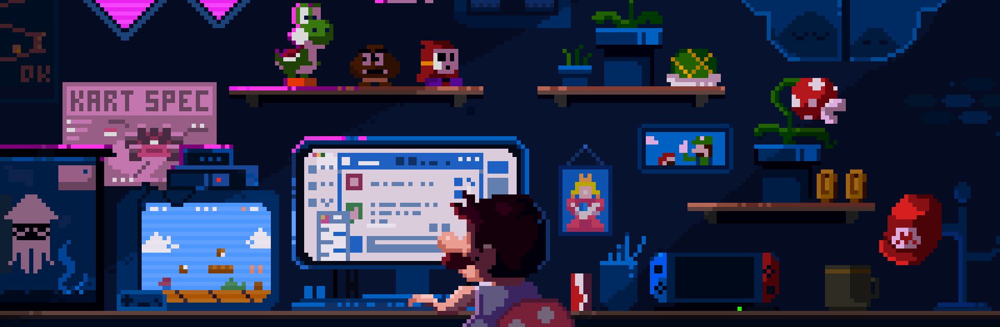

<h1>Hi there, I'm Antonio! </h1>

- 👾 I'm currently employed full-time as a Software Developer @ Infigo IS, where I'm engaged in developing internal company projects.

- 🌱 I've recently completed my study of advanced JavaScript and am currently in the process of revising it while also embarking on learning Advanced CSS and Sass: Flexbox, Grid, Animations and More!

- 🚀 In free time i work on my own [Portfolio website](https://antonio-sertic-portfolio.netlify.app)

- 📫 How to reach me: sertic43@gmail.com

 

